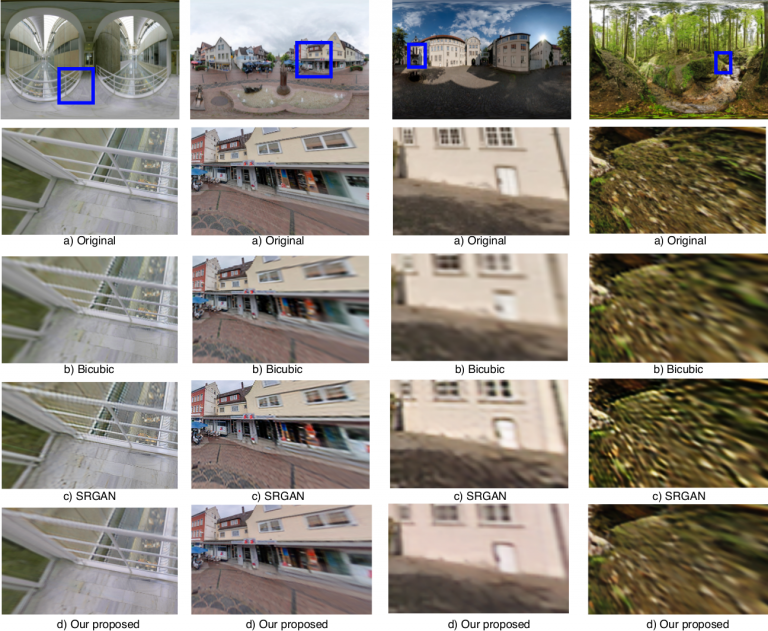

# 360SR
A PyTorch implementation of Super-resolution of Omnidirectional Images Using Adversarial Learning 

## Abstract

An omnidirectional image (ODI) enables viewers to look in every direction from a fixed point through a head-mounted display providing an immersive experience compared to that of a standard image. Designing immersive virtual reality systems with ODIs is challenging as they require high resolution content. In this paper, we study super-resolution for ODIs and propose an improved generative adversarial network based model which is optimized to handle the artifacts obtained in the spherical observational space. Specifically, we propose to use a fast PatchGAN discriminator, as it needs fewer parameters and improves the super-resolution at a fine scale. We also explore the generative models with adversarial learning by introducing a spherical-content specific loss function, called 360-SS. To train and test the performance of our proposed model we prepare a dataset of 4500 ODIs. Our results demonstrate the efficacy of the proposed method and identify new challenges in ODI super-resolution for future investigations.

## Requirements
- [Anaconda](https://www.anaconda.com/download/)
- PyTorch
```
conda install pytorch torchvision -c pytorch
```
- tqdm
```
conda install tqdm
```
- opencv
```
conda install opencv
```

## Testing pre-trained models

You need to download pre-trained models with [this link](http://v-sense.scss.tcd.ie/Datasets/SR360_models.zip) and extract in into `models` directory.

## Datasets

The train, val, and test datasets are sampled from [SUN360](http://people.csail.mit.edu/jxiao/SUN360/).
The dataset has 16700 images and Val dataset has 425 images.
Download the datasets and then extract it into `data` directory.

## Usage

### Train
```
python train.py

optional arguments:
--crop_size                   training images crop size [default value is 88]
--upscale_factor              super resolution upscale factor [default value is 8](choices:[2, 4, 8])
--num_epochs                  train epoch number [default value is 100]
```

### Test

```
python test.py

optional arguments:
--upscale_factor              super resolution upscale factor [default value is 8](choices:[2, 4, 8])
--test_mode 				  [default is 'GPU'] and choices:['GPU', 'CPU']
parser.add_argument('--model_name', default='8x_G.pth', type=str, help='generator model epoch name')
```


## Results


## Citation

| Paper accepted in [IEEE 21st International Workshop on Multimedia Signal Processing (MMSP 2019)](https://mmsp2019.org/) |

Please cite our [paper](https://v-sense.scss.tcd.ie/wp-content/uploads/2019/09/mmsp_sr_2019.pdf) in your publications if it helps your research:
````
@inproceedings{sr360,
author={C. {Ozcinar} and A. {Rana} and A. {Smolic}}, 
booktitle={IEEE 21st International Workshop on Multimedia Signal Processing (MMSP 2019)}, 
title={Super-resolution of Omnidirectional Images Using Adversarial Learning}, 
year={2019}, 
month={Sep}
}
````
## Authors

| [Cagri Ozcinar][CagriOzcinar-web] | [Aakanksha Rana][Aakanksha-web] | [Aljosa Smolic][AljosaSmolic-web] |

[CagriOzcinar-web]: (https://www.scss.tcd.ie/~ozcinarc/)

[Aakanksha-web]: (https://v-sense.scss.tcd.ie/?profile=template_profile)

[AljosaSmolic-web]: (https://v-sense.scss.tcd.ie/?profile=prof-aljosa-smolic-2)

## Acknowledgement

This publication has emanated from research conducted with the financial support of Science Foundation Ireland (SFI) under the Grant Number *15/RP/2776*. We gratefully acknowledge the support of NVIDIA Corporation for the donation of GPUs used in this work.

## Contact

If you have any question, send an e-mail at [ozcinarc@scss.tcd.ie]() or [ranaa@scss.tcd.ie]()